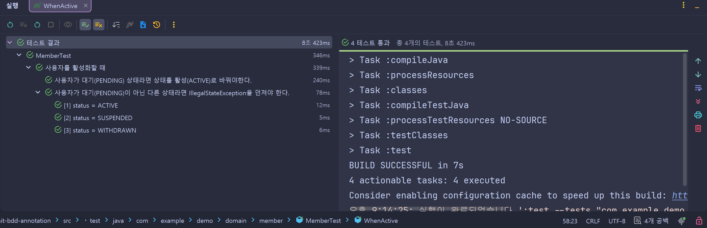

### 개요

JUnit DisplayNameGenerator를 활용하면 커스텀 어노테이션 등을 통해 테스트명 표시 규칙을 커스터마이즈할 수 있다. 

개인적으로 BDD에서 활용되는 테스트 네이밍 컨벤션 중 ***Should-When*** 방식이 마음에 들어서 적용해보았다. 팀/프로젝트의 취향에 따라 얼마든지 변형해서 적용 가능하다.

### 적용 예시

- 아래는 `MemberTest` 중 일부이다:

```java
@BDD
class MemberTest {
    // ...
    
    @Nested
    @When("사용자를 활성화할 때")
    class WhenActive {
        @Test
        @When("사용자가 대기(PENDING) 상태라면")
        @Should("상태를 활성(ACTIVE)로 바꿔야한다.")
        void shouldSuccessfullyActive() {
            Member member = pending();

            member.activate();

            assertThat(member.getStatus()).isEqualTo(MemberStatus.ACTIVE);
        }

        @ParameterizedTest
        @EnumSource(
                value = MemberStatus.class,
                names = {"ACTIVE", "SUSPENDED", "WITHDRAWN"})
        @When("사용자가 대기(PENDING)이 아닌 다른 상태라면")
        @Should("IllegalStateException을 던져야 한다.")
        void shouldThrowException_WhenNotPending(MemberStatus status) {
            Member member = of(status).create();

            assertThatThrownBy(() -> member.activate()).isInstanceOf(IllegalStateException.class);
        }
    }
    
    // ...
}
```

- `@When("...")`: "~할 때", "~라면" 등 상태나 조건을 명시한다.
- `@Should("...")`: "~해야 한다.", "~하지 말아야 한다." 등 검증하고자 하는 것을 명시한다.
- `@When("...")`에 쓴 내용과 `@Should("...")`에 쓴 내용이 띄어쓰기(` `)로 합쳐져서 테스트명에 표시된다. `@DisplayName("...")`에 두 문 장을 쓴 것과 같다.
- 테스트 또는 테스트 작성자가 너무 많아져 `@DisplayName("...")` 혹은 메서드명만으로는 어떤 테스트 작명(이름은 또 구성에 영향을 주므로 구성까지) 표준을 효과적으로 강제하거나, 표준화된 방식이 있다해도 그 전체 문장을 읽기 전까지 의도를 파악하기 어려운 경우 이러한 방식을 활용할 수 있다. 

### 테스트 결과



- 그냥 각 어노테이션의 `value`를 추출해서 문자열을 취향껏 만드는 것이기 때문에, 원한다면 중간에 화살표(`→`)를 넣는 등 마음껏 꾸밀 수도 있다. 개인적으로는 너무 지저분해지는 것 같아 띄워쓰기로 그쳤다.
- `BddDisplayNameGenerator`를 참조.
- `@DisplayNameGeneration(BddDisplayNameGenerator.class)`를 테스트 클래스에 붙여주므로써 적용할 `DisplayNameGenerator` 클래스를 지정해줘야 하는데, 조금 예쁘게 `@BDD`라는 메타 어노테이션으로 묶었다.